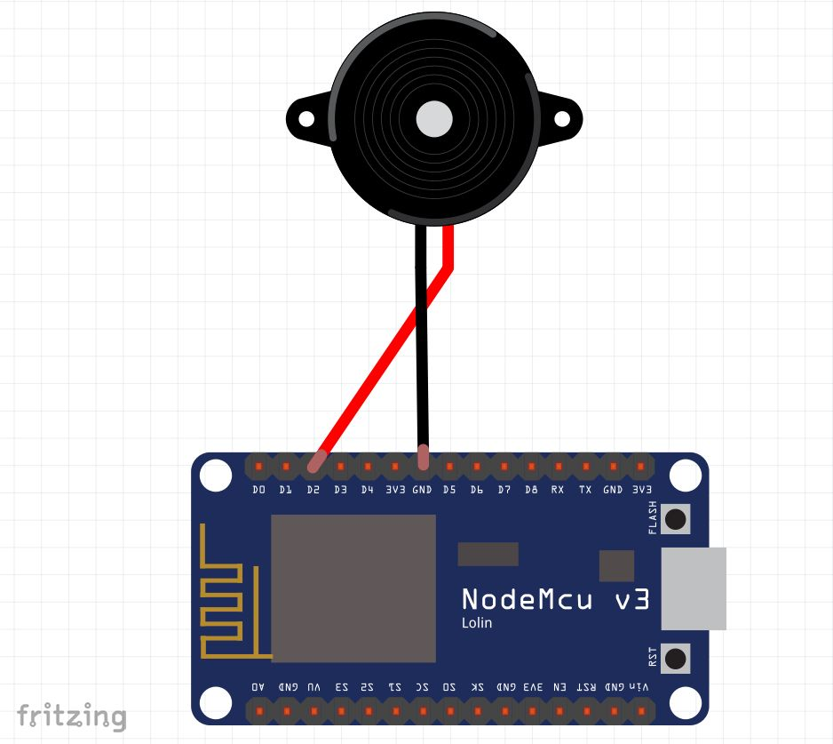
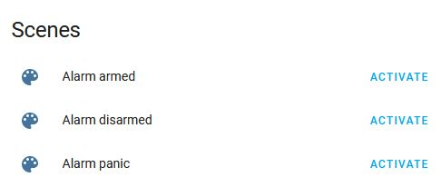

# HassAlarmBuzzer

In my opinion the [manual alarm control panel](https://www.home-assistant.io/integrations/manual/) is one of the best features you should have in your Homeassistant. It doesn’t require any special hardware. You can use any of your typical sensors and smart switches (like IKEA Tradfri, Shelly, Sonoff and many more) or you can build your own hardware control panel. There is only one problem. It won’t give you feedback unless you are controlling it through the Homeassistant app. Because I prefer the headless usage, I’ve decided to build my own WiFi enabled MQTT buzzer, which beeps every time when I arm or disarm the alarm.

## Components

You’ll need only following components:
- ESP8266, ESP32, Arduino or any of your favourite microcontrollers
- Piezo buzzer – mine is … but you can use any (passive) piezo buzzer which works with 3,3v
- Running MQTT Broker in Homeassistant

The assembly is easy, just connect your piezo buzzer between two GPIOs, for example GPIO04 (D2 on NodeMCU) and GND. That’s it, simple.



## Piezzo Buzzer

You should keep in mind, that unless your buzzer has an extra circuitry, you cannot just apply high logic (3,3v) to it and expect sound. You have to modulate it using PWM. But no worries, [tone() function](https://www.arduino.cc/reference/en/language/functions/advanced-io/tone/) from Arduino got our back. We just need to specify a GPIO pin of the buzzer and frequency of the tone. If you like to, try following examples:

### Single beep
```c
tone(4, 1100);
delay(100);
noTone(4);
```

### Double beep
```c
tone(4, 1100);
delay(100);
noTone(4);
delay(125);
tone(4, 1100);
delay(100);
noTone(4);
```

## MQTT

[MQTT](https://en.wikipedia.org/wiki/MQTT) is one of the most convenience ways how to communicate with your IoT devices. To make it even easier, Homeassistant implemented a functionality called [MQTT Discovery](https://www.home-assistant.io/docs/mqtt/discovery/). When you add a new MQTT entity using discovery, you don’t need to make any changes to your `configuration.yaml` file or execute reboot to apply those changes. Everything is done automatically by the Homeassistant MQTT integration.

But it's not all sunshine and roses. The matter is that there is no support for MQTT buzzers currently. Don’t worry, this isn´t a problem for us, because we can hijack the scene component. Those new entities will be rendered on your Dashboard like this:



As you can see I’ve implemented three sounds. A single beep for arming, double beep for disarming and siren for panic. Feel free to add a new one or modify one of those if you need to.

## Implementation

Find the whole sketch in `HassAlarmBuzzer.ino` file. Download and flash it, but don’t forget to specify your WiFi credentials and MQTT parameters beforehand. Look for following lines at the beginning of the sketch:

```
#include <ESP8266WiFi.h>
#include <PubSubClient.h>
#include <WiFiClient.h>

#define WIFI_SSID "ssid"
#define WIFI_PASS "pass"
#define MQTT_BROKER "homeassistant.local"
#define MQTT_USER "mqtt-user"
#define MQTT_PASS "mqtt-pass"
```

> Notice that the MQTT comunication uses my favourite [PubSubClient](https://github.com/knolleary/pubsubclient) library. You need to install it manually or through Library Manager in Arduino.

After flashing wait few seconds for the MQTT discovery to do its job. Now test it by activating those new scenes. You should hear the beeps.

The last step is to add those beeps (scenes) into your alarm automation. Here are two examples from my home.

### Disarming automation
```
alias: '[Alarm] is disarmed'
description: 'This will be executed after the alarm is disarmed'
trigger:
  - platform: state
    to: disarmed
    entity_id: alarm_control_panel.room_alarm
action:
  - type: turn_on
    device_id: 99bf920a0f69b5e7236f5b8450916abe
    entity_id: switch.pc_monitor
    domain: switch
  - scene: scene.alarm_disarmed
mode: single
```

### Arming automation
```
alias: '[Alarm] is arming, confirm state'
description: 'Execute this when alarm is arming, you should leave the home now'
trigger:
  - platform: state
    entity_id: alarm_control_panel.room_alarm
    to: arming
action:
  - scene: scene.alarm_armed
mode: single
```

That’s it! Finally, enjoy the feedback from your manual alarm control. 